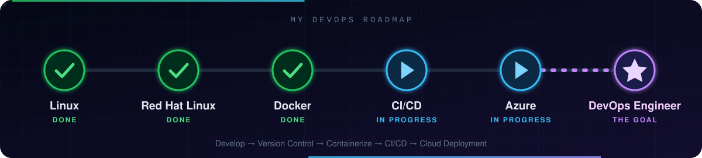

<!-- ═══════════════ ANIMATED INTRO ═══════════════ -->
<div align="center">



<br/>


<br/><br/>

<a href="https://www.linkedin.com/in/sameer-khuhro"></a>
<a href="https://github.com/sameerkhuhro"></a>
<a href="https://www.instagram.com/sameer.khuhro"></a>

</div>

---

## 👨‍💻 About Me

```yaml
name:       Sameer Khuhro
role:       Software Engineering Student @ MUET
focus:      [Web Development, DevOps, Cloud Infrastructure, Automation]
experience: DevOps / Infrastructure Engineering Intern @ Arcana Info (Pvt.) Ltd.
community:  Microsoft Learn Student Ambassador — MLSA MUET Khairpur (Co-Lead)
mission:    Build apps, then containerize, deploy, automate & maintain them
```

I enjoy building web applications and learning how modern software is **shipped and run in the real world** — from the first commit to a live cloud deployment.

---

## ✅ What I've Done

<table>
<tr>
<td width="33%" valign="top" align="center">


### Linux


System administration, networking, firewall configuration, system services and troubleshooting.

</td>
<td width="33%" valign="top" align="center">


### Red Hat Linux


Hands-on **RHEL** administration during my DevOps / Infrastructure internship at Arcana Info.

</td>
<td width="33%" valign="top" align="center">


### Docker


Dockerfiles, images & containers, port mapping, networks, volumes, bind mounts, **Docker Compose** and multi-container apps.

</td>
</tr>
</table>

---

## 🎯 Now: Becoming a DevOps Engineer

With Linux, Red Hat and Docker behind me, I'm now moving into **CI/CD, Microsoft Azure and cloud deployment automation** — the final steps to becoming a **DevOps Engineer**.

<div align="center">
  
</div>

> **Development → Version Control → Containerization → CI/CD → Cloud Deployment**

---

## 🧰 Tech Stack

### 🌐 Web Development
<p>
  
</p>

### ⚙️ DevOps & Cloud
<p>
  
</p>

### 💻 Languages
<p>
  
</p>

### 🛠️ Tools
<p>
  
  
  
  
</p>

---

## 💼 Experience

<table>
<tr>
<td width="60">🏢</td>
<td>

### DevOps / Infrastructure Engineering Intern
**Arcana Info (Pvt.) Ltd.**

- 🐧 Linux / **RHEL** system administration & system services
- 🌐 Networking and firewall configuration
- 🐳 Docker containerization & application deployment
- 🔀 Git & GitHub workflows
- 🛡️ Nginx web servers
- ☁️ Azure infrastructure
- 🔧 Deployment troubleshooting

> Learned how applications move beyond development into **deployment, infrastructure and production-oriented workflows**.

</td>
</tr>
</table>

---

## 🚀 Featured Projects

<table>
<tr>
<td width="50%" valign="top">

### 🌦️ Weather Web Application
Responsive weather app powered by a public weather API, containerized and served through Nginx.


</td>
<td width="50%" valign="top">

### ⚡ FastAPI System Information API
Backend API exposing system health and machine information, run as a Linux `systemd` service.


</td>
</tr>
<tr>
<td width="50%" valign="top">

### 🐳 Dockerized Web Applications
Hands-on containerization: Dockerfiles, images & containers, port mapping, networks, volumes & bind mounts, **Docker Compose** and multi-container apps.


</td>
<td width="50%" valign="top">

### 🗄️ Contact Management System
Desktop application to manage contacts with persistent local storage, built with solid OOP design.


</td>
</tr>
<tr>
<td colspan="2" valign="top">

### 💰 Personal Finance Tracker
Web-based app for managing and tracking personal financial records.


</td>
</tr>
</table>

---

## 🏆 Community & Leadership

<table>
<tr>
<td width="60">🎓</td>
<td>

**Microsoft Learn Student Ambassador — Co-Lead**
*MLSA MUET Khairpur*

Organizing technical events and workshops, helping students explore modern technologies, and supporting **OpenHack** activities focused on practical software development and problem solving.

</td>
</tr>
</table>

---

## 📊 GitHub Stats

<div align="center">


</div>

---

## 🐍 Contribution Snake

<div align="center">
  <picture>
    <source media="(prefers-color-scheme: dark)" srcset="https://raw.githubusercontent.com/sameerkhuhro/sameerkhuhro/output/github-snake-dark.svg" />
    <source media="(prefers-color-scheme: light)" srcset="https://raw.githubusercontent.com/sameerkhuhro/sameerkhuhro/output/github-snake.svg" />
    
  </picture>
</div>

---

<div align="center">

### **Web Development × DevOps × Cloud**

*I want to be an engineer who doesn't just **build** applications,*
*but also **containerizes, deploys, automates and maintains** them.*

🏏 Cricket enthusiast &nbsp;•&nbsp; 🎤 Tech community organizer &nbsp;•&nbsp; 🚀 Always building & experimenting

<br/>

<a href="https://www.linkedin.com/in/sameer-khuhro"></a>
<a href="https://github.com/sameerkhuhro"></a>
<a href="https://www.instagram.com/sameer.khuhro"></a>


</div>
